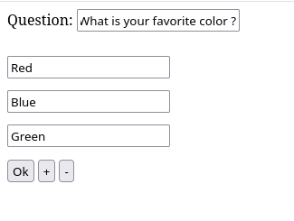
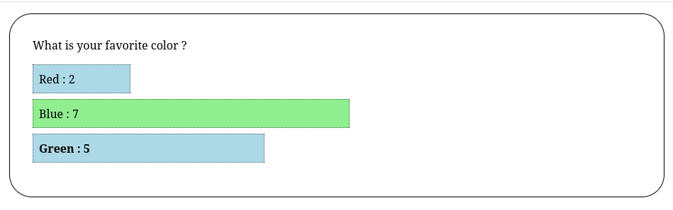

# Liliquiz - Ultra simple Live Poll




An ultra simple live polling app. Fill out a form, point people to the
URL, results in realtime.

Absolutely no attempt is made at stopping people from voting multiple times.
In fact, refreshing the page is enough to vote again. This is by design.

The polling control form is password-protected.

## Usage


```
npm install
PASSWORD=my_admin_password node index.js
```

Point your students to the root URL.

Go to `/login` to login with the admin password.

Go to `/choices` to start a poll (admin only).

Going to `/#abstain` will skip the vote and go straight to the results.
